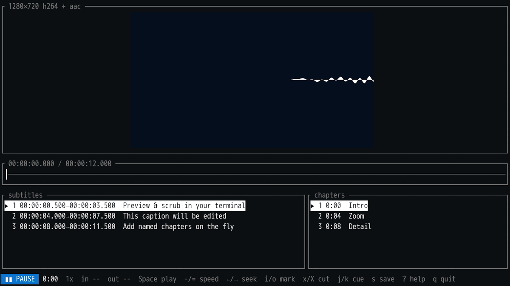

# editty

A terminal video editor for [kitty](https://sw.kovidgoyal.net/kitty/). Preview a
video right in your terminal using kitty's graphics protocol, mark in/out points
to cut a clip, and edit the associated WebVTT subtitles — all keyboard-driven,
all backed by `ffmpeg`.

editty is built for a fast local workflow: it streams frames over kitty's
**shared-memory transport** (no base64/PTY overhead), double-buffers them for
**zero flicker**, and plays audio in sync via `ffplay`.

## Demo



## Features

- **Preview / scrub** — the current frame is drawn in-terminal via the kitty
  graphics protocol. Seek by seconds, jump by percentage, or step exact frames.
- **Playback with audio** — `Space` plays from the playhead with synced sound;
  variable speed from **0.25× to 2×**, pitch-preserved (like YouTube).
- **Cutting** — mark an IN and OUT point and export the segment, either a fast
  stream-copy or a frame-accurate re-encode. You name the output file. If
  subtitles are loaded, a matching `<clip>.vtt` is written next to the clip with
  the cues clipped to the range and rebased to start at 0.
- **WebVTT editing** — a cue list that follows the playhead; edit cue text, snap
  cue start/end to the playhead, add/delete cues, and save. The original `.vtt`
  is backed up to `.vtt.orig` before the first overwrite.
- **Chapters** — named markers (YouTube-style points) in their own list beside
  the cues. Add a chapter at the playhead, name it, jump between chapters, and
  save to a sibling `<video>.chapter.txt` (one `M:SS Title` per line). It's
  auto-loaded when the video opens, and clipped + rebased into a matching
  `<clip>.chapter.txt` whenever you export a segment.
- **Non-destructive** — cuts go to new files; subtitle and chapter saves keep a
  pristine backup. Nothing is overwritten without a prompt.

## Prerequisites

- **macOS** (developed and tested there; should also work on Linux with kitty,
  untested). Windows is not supported.
- A terminal that implements the **kitty graphics protocol** — required for
  video preview. editty detects support at runtime (by querying the terminal),
  so [kitty](https://sw.kovidgoyal.net/kitty/),
  [Ghostty](https://ghostty.org/), [WezTerm](https://wezterm.org/), and Konsole
  all work. Run in a *bare* terminal window, **not** inside tmux/screen, where
  the protocol doesn't pass through. Shared-memory transport is used when the
  terminal supports it, otherwise editty falls back automatically.
- **ffmpeg** — provides `ffmpeg`, `ffprobe`, and `ffplay` (used for metadata,
  frame extraction, cutting, and audio playback).
- **Rust** toolchain (2024 edition, Rust 1.85+) to build.

On macOS with Homebrew:

```sh
brew install kitty ffmpeg
# Rust, if you don't have it:
curl --proto '=https' --tlsv1.2 -sSf https://sh.rustup.rs | sh
```

## Install

### Homebrew (recommended)

```sh
brew tap mkasa/editty
brew install editty
```

This pulls in `ffmpeg` automatically and builds editty from source. (You still
need a kitty-graphics-capable terminal to preview video — see Prerequisites.)

### From source

```sh
# from the project directory
cargo build --release
# the binary is at target/release/editty

# …or install it onto your PATH (~/.cargo/bin):
cargo install --path .
```

## Usage

```sh
editty <video> [--vtt <file>]
```

- `<video>` — the video to open.
- `--vtt <file>` — a WebVTT subtitle file. If omitted, a sibling `<video>.vtt`
  is loaded automatically when present; pass a non-existent path to start a new
  subtitle file.

Diagnostic / spike mode (prints a single frame and exits — handy to confirm
graphics work in your terminal):

```sh
editty <video> --show <seconds>
```

> **Tip:** if the video pane is blank, you're probably not in a bare kitty
> window. Over SSH (or to force the slower base64 transport) editty falls back
> automatically; you can also set `EDITTY_NO_SHM=1` to disable shared memory.

### Keys

Press `?` any time for this list.

| Keys | Action |
|------|--------|
| `Space` | play / pause (with audio) |
| `-` / `=` | slower / faster (0.25×–2×, pitch preserved) |
| `←` / `→` | seek ∓1 second |
| `<` / `>` | seek ∓10 seconds |
| `,` / `.` | step one frame (frame-accurate) |
| `0`–`9` | jump to 0–90% of the duration |
| `Home` / `End` | jump to start / end |
| `i` / `o` | set IN / OUT marker |
| `C` | clear markers |
| `x` / `X` | export clip — fast (stream copy) / precise (re-encode) |
| `j` / `k` (or `↓`/`↑`) | select previous / next cue (seeks to it) |
| `Enter` | edit selected cue text |
| `[` / `]` | snap cue start / end to the playhead |
| `n` / `d` | new cue at playhead / delete selected cue |
| `s` | save the `.vtt` (backs up the original to `.vtt.orig`) |
| `m` | new chapter at playhead (then type a title) |
| `e` | edit selected chapter title |
| `{` / `}` | select previous / next chapter (seeks to it) |
| `M` | delete selected chapter |
| `S` | save the `.chapter.txt` (backs up the original to `.chapter.txt.orig`) |
| `?` | toggle help |
| `q` / `Esc` | quit |

When exporting (`x`/`X`) you're prompted for a filename (Ctrl-U clears it,
`Enter` cuts, `Esc` cancels). A bare name is saved next to the source video; a
path or absolute name is honored as-is; omit the extension to inherit the
source's.

## How it works

- `ffprobe` reads metadata (duration, fps, resolution, codecs).
- Scrubbing extracts one frame at a time via `ffmpeg` (fast keyframe seek for
  dragging; a two-stage seek for frame-accurate stepping), scaled to the pane.
- Playback streams raw RGBA frames from `ffmpeg` into a reader thread while
  `ffplay` plays audio; a wall clock drives sync and late frames are dropped.
- Frames reach kitty over the shared-memory transport when local, double-buffered
  across two image ids so a new frame is drawn before the old is removed.
- Cutting shells out to `ffmpeg` (`-c copy` for fast, `libx264`/`aac` for precise).
- Subtitles are parsed and re-serialized with round-trip fidelity (NOTE/STYLE/
  REGION blocks are preserved).
- Chapters are plain `M:SS Title` text (`<video>.chapter.txt`); on a cut the
  chapter covering the IN point becomes the clip's `0:00` and later chapters are
  rebased, mirroring how subtitles are clipped.
