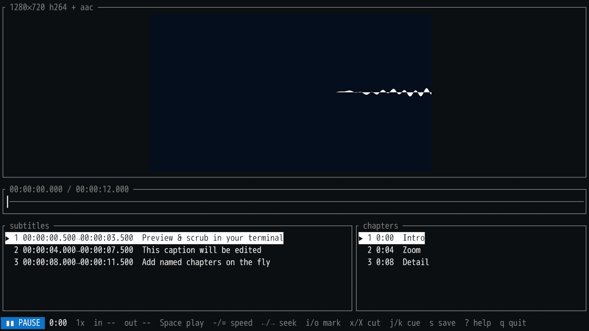

# editty

A terminal video editor for [kitty](https://sw.kovidgoyal.net/kitty/). Preview a
video right in your terminal using kitty's graphics protocol, mark in/out points
to cut a clip, and edit the associated WebVTT subtitles — all keyboard-driven,
all backed by `ffmpeg`.

editty is built for a fast local workflow: it streams frames over kitty's
**shared-memory transport** (no base64/PTY overhead), double-buffers them for
**zero flicker**, and plays audio in sync via `ffplay`.

## Demo



## Features

- **Preview / scrub** — the current frame is drawn in-terminal via the kitty
  graphics protocol. Seek by seconds, jump by percentage, or step exact frames.
- **Playback with audio** — `Space` plays from the playhead with synced sound;
  variable speed from **0.25× to 2×**, pitch-preserved (like YouTube).
- **Subtitles on the picture** — with subtitles loaded, the cue under the
  playhead is captioned across the foot of the video pane: full terminal width,
  centred, wrapped over up to three lines. The cue list is only 60% wide and
  truncates, so this is where a long sentence can actually be read. The picture
  is scaled to the space above the strip, never behind it.
- **Cutting** — mark an IN and OUT point and export the segment, either a fast
  stream-copy or a frame-accurate re-encode. You name the output file. If
  subtitles are loaded, a matching `<clip>.vtt` is written next to the clip with
  the cues clipped to the range and rebased to start at 0.
- **WebVTT editing** — a cue list that follows the playhead: the cue covering it
  stays selected and centred, so the list scrolls along as the video plays or you
  seek, and pausing leaves you on the cue you just heard, ready to edit. Edit cue
  text, snap cue start/end to the playhead, add/delete cues, and save. The `.vtt`
  is backed up to `.vtt.orig` before the first overwrite. Editing a cue is a
  real line editor: the cursor moves by character or word so you can change the
  middle of a sentence, and long text wraps over as many rows as it needs — the
  list scrolls with the cursor, so the end of a long cue is always reachable.
- **Search** — `/` finds a word in the cue text (case-insensitive). Every
  occurrence is highlighted in the list, and `Tab` / `Shift-Tab` walk the
  matching cues — selecting each one and taking the video to it — wrapping at
  the ends and counting off "match 3 of 7" in the status bar. Searching for
  nothing clears it again.
- **Subtitle generation (WhisperX)** — with no subtitles loaded, press `G` to
  transcribe the audio with [WhisperX](https://github.com/m-bain/whisperX). On
  first use it creates a dedicated `whisperx` conda env and installs WhisperX;
  then it transcribes (GPU if available, else CPU) and loads the result for
  editing. Runs in the background so the UI stays responsive.
- **Chapters** — named markers (YouTube-style points) in their own list beside
  the cues, following the playhead just as the cue list does. Add a chapter at
  the playhead, name it, jump between chapters, and save to a sibling
  `<video>.chapter.txt` (one `M:SS Title` per line). It's
  auto-loaded when the video opens, and clipped + rebased into a matching
  `<clip>.chapter.txt` whenever you export a segment.
- **Non-destructive** — cuts go to new files; subtitle and chapter saves keep a
  pristine backup. Nothing is overwritten without a prompt.

## Prerequisites

- **macOS** (developed and tested there; should also work on Linux with kitty,
  untested). Windows is not supported.
- A terminal that implements the **kitty graphics protocol** — required for
  video preview. editty detects support at runtime (by querying the terminal),
  so [kitty](https://sw.kovidgoyal.net/kitty/),
  [Ghostty](https://ghostty.org/), [WezTerm](https://wezterm.org/), and Konsole
  all work. Run in a *bare* terminal window, **not** inside tmux/screen, where
  the protocol doesn't pass through. Shared-memory transport is used when the
  terminal supports it, otherwise editty falls back automatically.
- **ffmpeg** — provides `ffmpeg`, `ffprobe`, and `ffplay` (used for metadata,
  frame extraction, cutting, and audio playback).
- **Rust** toolchain (2024 edition, Rust 1.85+) to build.
- **conda** (Anaconda/Miniconda) — *optional*, only for WhisperX subtitle
  generation (`G`). editty creates the `whisperx` env and installs WhisperX on
  first use; a CUDA GPU is used automatically when present.

On macOS with Homebrew:

```sh
brew install kitty ffmpeg
# Rust, if you don't have it:
curl --proto '=https' --tlsv1.2 -sSf https://sh.rustup.rs | sh
```

## Install

### Homebrew (recommended)

```sh
brew tap mkasa/editty
brew install editty
```

This pulls in `ffmpeg` automatically and builds editty from source. (You still
need a kitty-graphics-capable terminal to preview video — see Prerequisites.)

### From source

```sh
# from the project directory
cargo build --release
# the binary is at target/release/editty

# …or install it onto your PATH (~/.cargo/bin):
cargo install --path .
```

## Usage

```sh
editty <video> [--vtt <file>]
```

- `<video>` — the video to open.
- `--vtt <file>` — a WebVTT subtitle file. If omitted, a sibling `<video>.vtt`
  is loaded automatically when present; pass a non-existent path to start a new
  subtitle file.
- `--whisper-model <name>` — Whisper model for `G` (default `large-v3`).
- `--whisper-device <cuda|cpu>` — force the device (default: auto-detect).
- `--whisper-lang <lang>` — spoken language (default: auto-detect).
- `--whisper-env <name>` — conda env to run/create WhisperX in (default `whisperx`).

Diagnostic / spike mode (prints a single frame and exits — handy to confirm
graphics work in your terminal):

```sh
editty <video> --show <seconds>
```

> **Tip:** if the video pane is blank, you're probably not in a bare kitty
> window. Over SSH (or to force the slower base64 transport) editty falls back
> automatically; you can also set `EDITTY_NO_SHM=1` to disable shared memory.

### Keys

Press `?` any time for this list.

| Keys | Action |
|------|--------|
| `Space` | play / pause (with audio) |
| `-` / `=` | slower / faster (0.25×–2×, pitch preserved) |
| `←` / `→` | seek ∓1 second |
| `<` / `>` | seek ∓10 seconds |
| `,` / `.` | step one frame (frame-accurate) |
| `0`–`9` | jump to 0–90% of the duration |
| `Home` / `End` | jump to start / end |
| `i` / `o` | set IN / OUT marker |
| `C` | clear markers |
| `x` / `X` | export clip — fast (stream copy) / precise (re-encode) |
| `j` / `k` (or `↓`/`↑`) | select previous / next cue (seeks to it) |
| `Enter` | edit selected cue text |
| `[` / `]` | snap cue start / end to the playhead |
| `n` / `d` | new cue at playhead / delete selected cue |
| `s` | save the `.vtt` (backs up the original to `.vtt.orig`) |
| `G` | generate subtitles with WhisperX (when none are loaded) |
| `/` | find a word in the cue text (`Enter` searches, `Esc` cancels) |
| `Tab` / `Shift-Tab` | jump to the next / previous match |
| `m` | new chapter at playhead (then type a title) |
| `e` | edit selected chapter title |
| `{` / `}` | select previous / next chapter (seeks to it) |
| `M` | delete selected chapter |
| `S` | save the `.chapter.txt` (backs up the original to `.chapter.txt.orig`) |
| `?` | toggle help |
| `q` / `Esc` | quit |

While editing text — a cue (`Enter`), a chapter title (`m`/`e`) or an export
filename (`x`/`X`) — the keys are those of an ordinary line editor:

| Keys | Action |
|------|--------|
| `←` / `→` | move the cursor one character |
| `Ctrl-←` / `Ctrl-→` | move the cursor one word |
| `Home` / `End` (or `Ctrl-A` / `Ctrl-E`) | start / end of the line |
| `Backspace` / `Delete` | delete before / under the cursor |
| `Ctrl-W` / `Ctrl-K` | delete the word before / the rest of the line |
| `Ctrl-U` | clear the line |
| `Enter` / `Esc` | commit / cancel |

Text longer than the pane wraps onto further rows, and the list scrolls to keep
the cursor in view. Multi-line cues are edited as one line (their line breaks
become spaces).

When exporting (`x`/`X`) you're prompted for a filename. A bare name is saved
next to the source video; a path or absolute name is honored as-is; omit the
extension to inherit the source's.

## How it works

- `ffprobe` reads metadata (duration, fps, resolution, codecs).
- Scrubbing extracts one frame at a time via `ffmpeg` (fast keyframe seek for
  dragging; a two-stage seek for frame-accurate stepping), scaled to the pane.
- Playback streams raw RGBA frames from `ffmpeg` into a reader thread while
  `ffplay` plays audio; a wall clock drives sync and late frames are dropped.
- Frames reach kitty over the shared-memory transport when local, double-buffered
  across two image ids so a new frame is drawn before the old is removed.
- Cutting shells out to `ffmpeg` (`-c copy` for fast, `libx264`/`aac` for precise).
- Subtitles are parsed and re-serialized with round-trip fidelity (NOTE/STYLE/
  REGION blocks are preserved).
- Chapters are plain `M:SS Title` text (`<video>.chapter.txt`); on a cut the
  chapter covering the IN point becomes the clip's `0:00` and later chapters are
  rebased, mirroring how subtitles are clipped.
